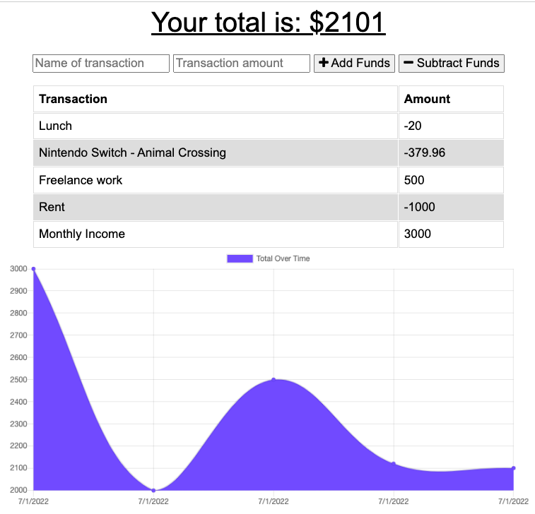
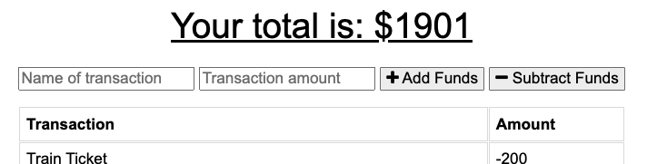
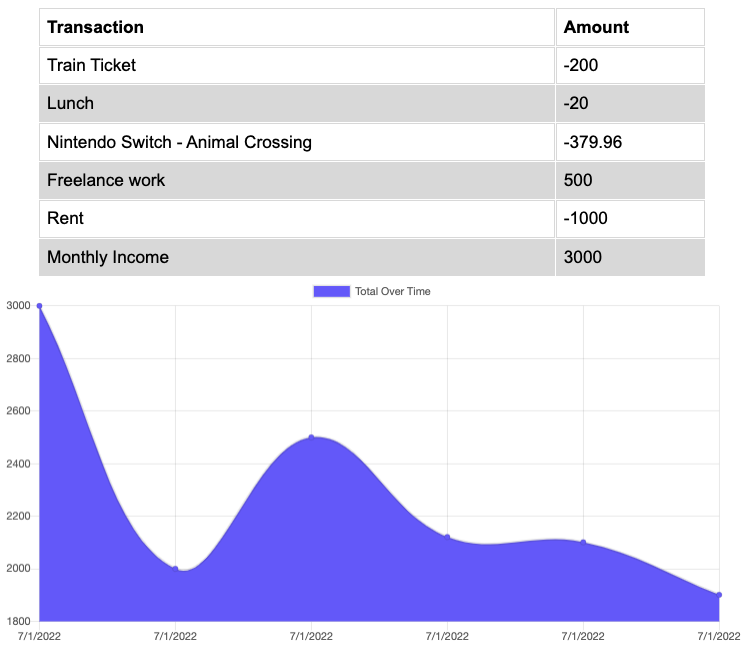
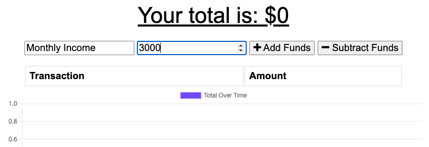
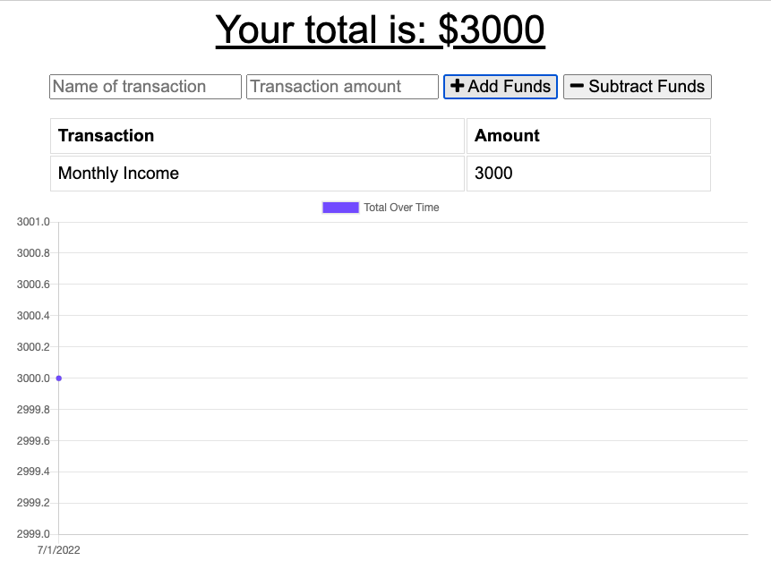
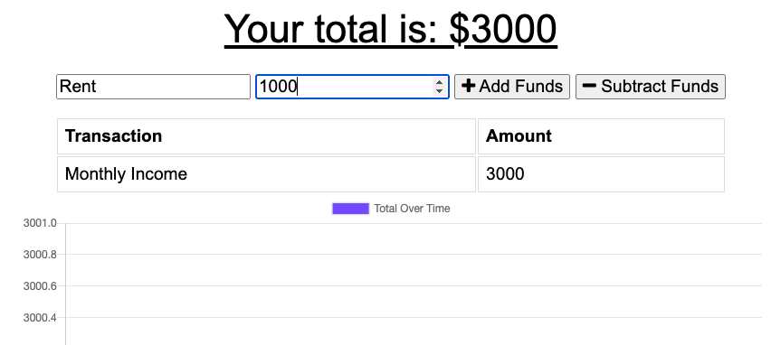
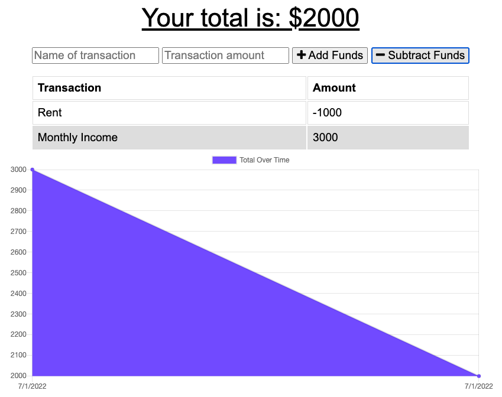

# Yurippe BudgeTracker

## Description
This will track your budget by entering what you earned and what you purchased even when you are in an offline network! Try this out to plan your money💰

## Table of Contents
- [Website](#website)
- [Usage](#usage)
- [License](#license)
- [Questions](#questions)

## Website
https://enigmatic-everglades-13899.herokuapp.com/

## Usage
1. Total budget amount shown at top
    
2. Visualize your past transactions as list and graph
    
3. Add your earnings
    1. Enter name of the transaction and its amount.
    
    2. Click `+ Add Funds` button.
    
4. Subtract your purchases from your budget
    1. Enter name of the transaction and its amount.
    
    2. Click `- Subtract Funds` button.
    
5. Can be used in offline network environment
    - It will save your transactions in its database even while you are offline.
    - It persists your offline transactions when you are back online.
    
6. Install the app
    - PC: Click the install button on the right-hand side of the url text area. 
    
    - Smartphone: Install by `Add to home screen` from `Share` menu.

## License
Licensed under the [MIT License](https://opensource.org/licenses/MIT).
      

## Questions
- GitHub Profile: https://github.com/YuriI92
- If you have any additional questions, please feel free to contact me by email.
  E-mail Address: <yurichikawa1992@gmail.com>
      
  